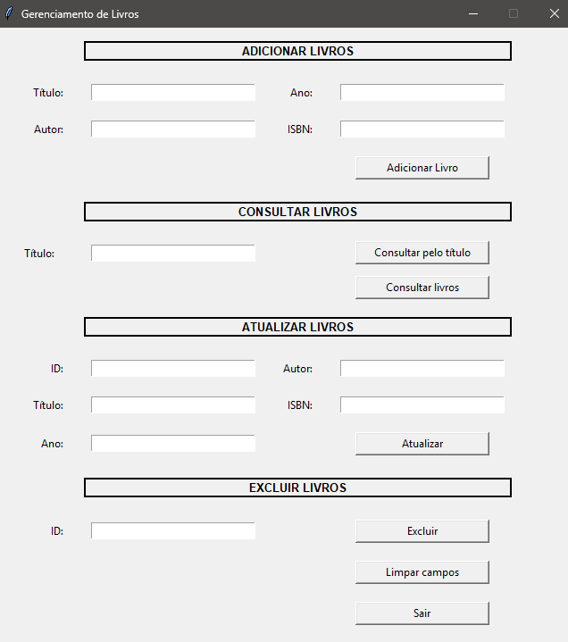

# 📚 Gerenciamento de Livros — Python + Tkinter + SQLite

Aplicação desktop desenvolvida em **Python** para gerenciamento de livros, com **interface gráfica (Tkinter)**, **autenticação de usuários**, **persistência em banco SQLite** e operações **CRUD completas**.

O projeto tem foco em **lógica de back-end**, organização de código e integração entre interface gráfica e banco de dados.

---

## 🖥️ Interface da Aplicação

> Tela principal do sistema após login, com cadastro, consulta, atualização e exclusão de livros.



---

## 🧠 Funcionalidades

### 🔐 Autenticação
- Cadastro de usuários com **hash de senha (SHA-256)**
- Login com validação de credenciais
- Controle de acesso à aplicação principal

### 📘 Livros (CRUD)
- Cadastrar livros (título, autor, ano e ISBN)
- Listar todos os livros cadastrados
- Buscar livros por título (case-insensitive)
- Atualizar dados de um livro pelo ID
- Excluir livros pelo ID

### 🧹 Validações
- Campos obrigatórios
- Tipos numéricos (ano e ID)
- Feedback visual com `messagebox`

---

## 🚀 Tecnologias Utilizadas

- Python 3
- Tkinter
- SQLite3
- Hashlib

---

## ▶️ Como Executar o Projeto

Certifique-se de ter o **Python 3** instalado.

Clone o repositório:
```bash
git clone https://github.com/seu-usuario/seu-repositorio.git
cd seu-repositorio
````
Execute a aplicação:
```bash
python main.py
````
O banco de dados será criado automaticamente na primeira execução.

## 👨‍💻 Autor

**Antony Severo**  
Estudante de **Análise e Desenvolvimento de Sistemas**  
